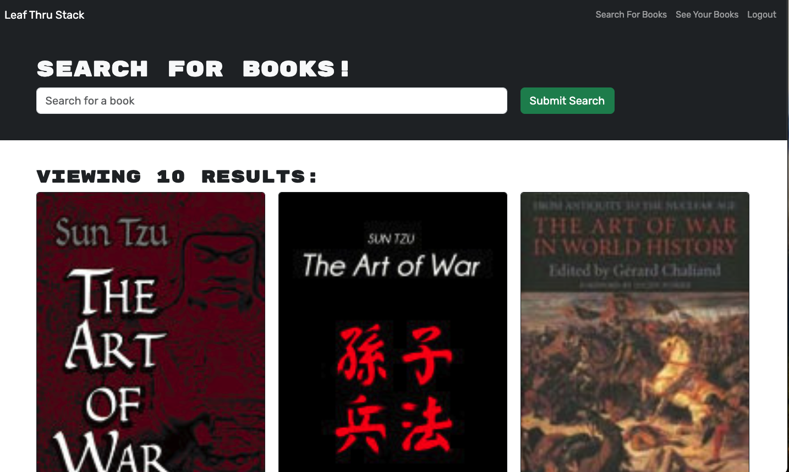
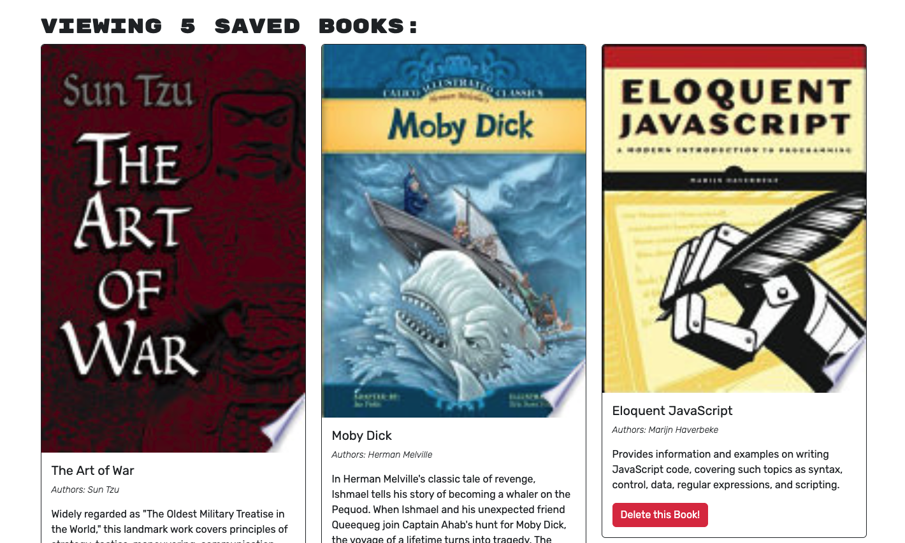
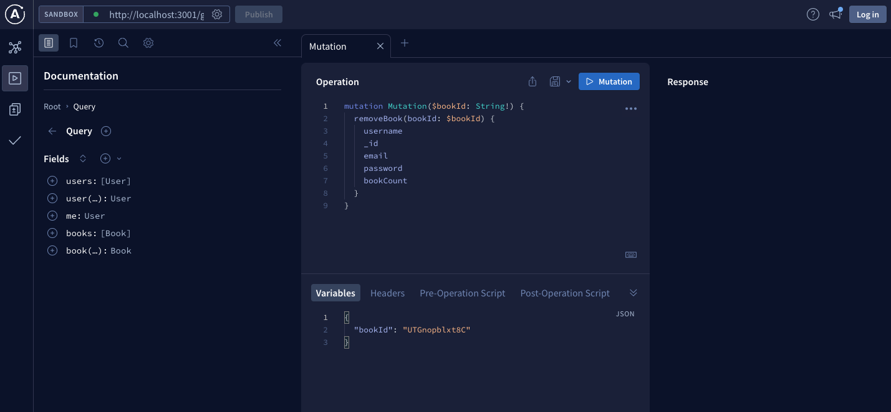

# Leaf Thru Stack

## Building a Book Search Engine (Leaf Thru Stack)

The purpose of this project is to create was to create a a full-stack book search engine using MongoDB, Express.js, React.js, and Node.js (MERN). This means the development of the front-end (Client-side) and the back-end (Server-side). In the application, the user is presented with a book search, a saved books, and login/sign-up pages. Developing this project demonstrates our full-stack development skills using MERN.

This project was developed with MongoDB. Using MongoDB assisted in forming and structuring of the database models. Along with forming the models. Graphql was used to assist in implementing the methods for the back-end.

The following is an image is the search page.

The Following image is example of the current user's saved books.

The Following image is example of Graphql Sandbox.

## Installation

N/A

## Usage

To view the application in action, simply click the following link: ADD LINK
The link will redirect you to RENDER where the user can see the application in action. The Leaf Thru Stack application functionality allows the user to search, save, and delete books. 

## Credits

N/A

## License

Please refer to the LICENSE in the repo.